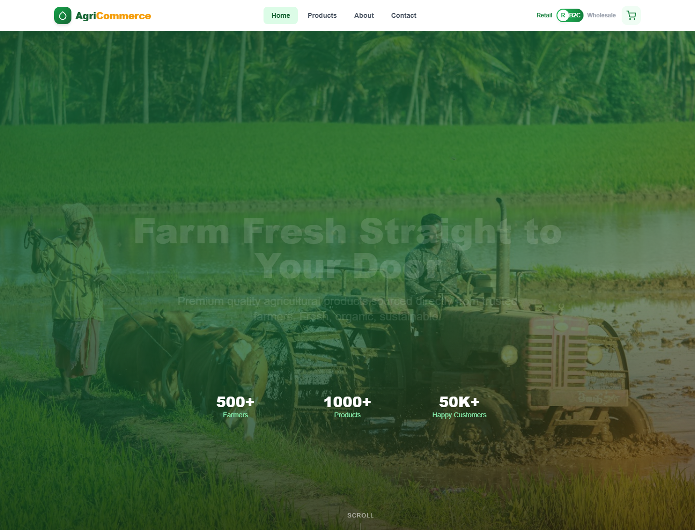
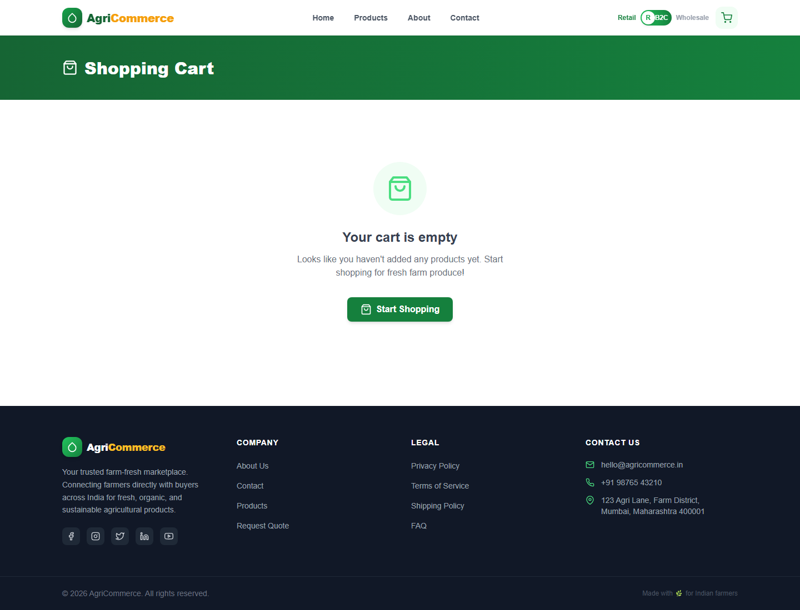
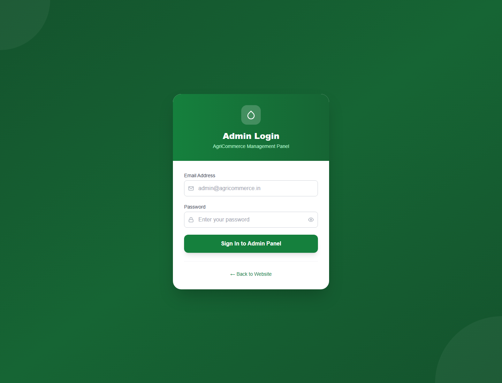

# AgriCommerce

AgriCommerce is a full-stack MERN agricultural e-commerce platform for retail customers and wholesale buyers. It includes a React storefront, B2C cart and checkout, B2B enquiry workflow, product/category management, homepage CMS controls, banners, orders, enquiries, and an authenticated admin dashboard.

## Features

- Customer storefront with home page, product listing, product details, cart, and checkout
- B2B wholesale mode with enquiry forms instead of public pricing/cart checkout
- Admin login and protected dashboard
- Product, category, banner, CMS page, homepage, enquiry, order, and settings management
- Image upload support for admin-managed content
- MongoDB-backed API with JWT authentication
- Seed script with sample products, categories, CMS pages, orders, enquiries, homepage content, and admin user

## Frontend Preview

### Home Page



### Cart Page



### Admin Login



## Project Structure

```text
agricommerce/
├── apps/
│   ├── backend/        # Node.js, Express, MongoDB, Mongoose API
│   └── frontend/       # React, Vite, Tailwind CSS app
├── packages/
│   └── shared/         # Shared package placeholder
├── package.json        # npm workspaces
└── README.md
```

## Tech Stack

- Frontend: React 18, Vite, React Router, Tailwind CSS, Axios, React Icons
- Backend: Node.js, Express, Mongoose, JWT, Multer, bcryptjs
- Database: MongoDB Atlas or local MongoDB
- Tooling: npm workspaces

## Prerequisites

- Node.js 18 or newer
- npm
- MongoDB connection string

## Environment Setup

Real `.env` files are intentionally ignored and should not be committed. Use the included examples:

```bash
cp apps/backend/.env.example apps/backend/.env
cp apps/frontend/.env.example apps/frontend/.env
```

Backend variables:

```env
PORT=5000
MONGODB_URI=mongodb+srv://<user>:<pass>@cluster.mongodb.net/agricommerce
JWT_SECRET=your_super_secret_jwt_key_change_this_in_production
JWT_EXPIRES_IN=7d
NODE_ENV=development
FRONTEND_URL=http://localhost:5173
UPLOAD_DIR=uploads
```

Frontend variables:

```env
VITE_API_URL=http://localhost:5000/api
VITE_UPLOAD_URL=http://localhost:5000
```

## Install

```bash
npm install
```

## Seed Database

```bash
npm run seed
```

Default seeded admin:

```text
Email: admin@agri.com
Password: Admin@1234
```

## Run Locally

Start the backend:

```bash
npm run dev:backend
```

Start the frontend:

```bash
npm run dev:frontend
```

Local URLs:

```text
Frontend: http://localhost:5173
Backend API: http://localhost:5000/api
Admin Login: http://localhost:5173/admin/login
Admin Dashboard: http://localhost:5173/admin/dashboard
```

## Build

```bash
npm run build --workspace=apps/frontend
```

## API Overview

| Method | Route | Description | Auth |
| --- | --- | --- | --- |
| POST | `/api/auth/login` | Admin login | Public |
| GET | `/api/auth/me` | Current admin user | Admin |
| GET | `/api/products` | List products | Public |
| GET | `/api/products/:slug` | Product detail | Public |
| POST | `/api/products` | Create product | Admin |
| PUT | `/api/products/:id` | Update product | Admin |
| DELETE | `/api/products/:id` | Delete product | Admin |
| GET | `/api/categories` | List categories | Public |
| POST | `/api/categories` | Create category | Admin |
| PUT | `/api/categories/:id` | Update category | Admin |
| DELETE | `/api/categories/:id` | Delete category | Admin |
| GET | `/api/homepage` | Homepage content | Public |
| PUT | `/api/homepage` | Update homepage | Admin |
| GET | `/api/banners` | List banners | Public |
| POST | `/api/banners` | Create banner | Admin |
| GET | `/api/cms/:slug` | CMS page | Public |
| PUT | `/api/cms/:slug` | Update CMS page | Admin |
| POST | `/api/enquiries` | Submit enquiry | Public |
| GET | `/api/enquiries` | List enquiries | Admin |
| PUT | `/api/enquiries/:id/status` | Update enquiry status | Admin |
| POST | `/api/orders` | Place customer order | Public |
| GET | `/api/orders` | List orders | Admin |
| PUT | `/api/orders/:id/status` | Update order status | Admin |
| GET | `/api/settings` | Site settings | Public |
| PUT | `/api/settings` | Update settings | Admin |
| POST | `/api/upload` | Upload image | Admin |

## B2C vs B2B Behavior

| Area | B2C Retail | B2B Wholesale |
| --- | --- | --- |
| Product price | Visible | Hidden behind quote flow |
| Cart | Enabled | Disabled |
| Checkout | Enabled | Uses enquiry instead |
| Product action | Add to cart | Request quote |
| Main lead flow | Place order | Send bulk enquiry |

## Deploy to Render (backend) + Vercel (frontend)

Push your code to GitHub first (`origin` should point to your repo).

### 1. MongoDB Atlas

1. Open [MongoDB Atlas](https://www.mongodb.com/cloud/atlas) and create a free cluster.
2. Create a database user and allow network access (`0.0.0.0/0` for Render).
3. Copy the connection string and set the database name to `agricommerce`:
   `mongodb+srv://<user>:<pass>@cluster.mongodb.net/agricommerce`

### 2. Render — backend API

**Option A — Blueprint (recommended)**

1. Go to [Render Dashboard](https://dashboard.render.com) → **New** → **Blueprint**.
2. Connect `Vaibhavmehta9/agricommerce` (or your fork).
3. Render reads `render.yaml` and creates `agricommerce-api`.
4. Set environment variables when prompted:
   - `MONGODB_URI` — your Atlas URI
   - `FRONTEND_URL` — your Vercel URL (set after step 3, then redeploy)
5. After deploy, note the API URL, e.g. `https://agricommerce-api.onrender.com`.

**Option B — Manual Web Service**

| Setting | Value |
| --- | --- |
| Root Directory | `apps/backend` |
| Build Command | `npm install` |
| Start Command | `npm start` |
| Health Check Path | `/api/health` |

Environment variables:

```env
NODE_ENV=production
MONGODB_URI=mongodb+srv://...
JWT_SECRET=<long-random-string>
JWT_EXPIRES_IN=7d
FRONTEND_URL=https://your-app.vercel.app
UPLOAD_DIR=uploads
```

**Seed production database (once)**

Render Dashboard → your service → **Shell**:

```bash
npm run seed
```

**Uploads note:** Render’s disk is ephemeral. Seed data uses external image URLs and works out of the box. Admin-uploaded files in `/uploads` are lost on redeploy; use Cloudinary or S3 for persistent uploads in production.

### 3. Vercel — frontend

1. Go to [Vercel](https://vercel.com) → **Add New** → **Project** → import your GitHub repo.
2. Set **Root Directory** to `apps/frontend` (Vercel will use `vercel.json` there).
3. Add environment variables **before** the first deploy:

```env
VITE_API_URL=https://agricommerce-api.onrender.com/api
VITE_UPLOAD_URL=https://agricommerce-api.onrender.com
```

4. Deploy. Your site will be at `https://<project>.vercel.app`.

### 4. Connect frontend and backend

1. Copy your Vercel URL.
2. In Render → **Environment** → set `FRONTEND_URL` to that URL → **Save** (triggers redeploy).
3. Vercel `*.vercel.app` origins are allowed by the API CORS config.

### 5. Verify

- API health: `https://<render-url>/api/health`
- Storefront: `https://<vercel-url>/`
- Admin: `https://<vercel-url>/admin/login` (`admin@agri.com` / `Admin@1234` after seeding)

### Free-tier notes

- Render free services spin down after ~15 min idle; first request may take 30–60s.
- Redeploy backend after changing `FRONTEND_URL` or `MONGODB_URI`.
- Rebuild frontend on Vercel whenever `VITE_API_URL` or `VITE_UPLOAD_URL` changes.

## Git Hygiene

The repository excludes:

- `node_modules/`
- real `.env` files
- build output such as `dist/` and `build/`
- runtime uploads
- editor and OS metadata

The safe `.env.example` files are included so other developers can configure the app without exposing secrets.
